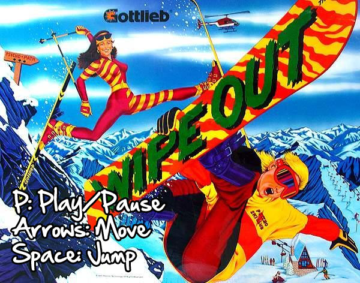

# Wipe Out

[Play online]() or deploy it locally by running:
```
npm install
npm run dev
```

## Controls
Avoid trees, jump over rocks, grab big air, and shred some gnar! 

|||
|:---|:---|
|P|Pause/Play
|Arrows|Move
|Space|Jump 

## Changes
One of the biggest changes was changing the entities over to use separate classes for their different states. This allowed for better code organization, made it easier to follow, and less error prone.

Hitting a ramp gives you enough time to do a front or back flip, but don't wait too long to start because you might not stick the landing.

 I added a little "flair" with a load/pause screen referencing Gottlieb's Wipe Out pinball machine, one of the cheesiest ski related pinball machines ever made. I also added in the pause music from Battletoads because that game is great and we used to dance like little idiots to it growing up so why not. 

A great place for future improvement would be creating Animation classes that can handle both loop and timeframe. The code for the animations, especially for the rhino, got pretty duplicative.

Checkout the commit logs for more specific details.

## Additional Credits
- Cover image from Gottlieb's Wipe Out pinball machine
- Pause music from Nintendo's Battletoads video game